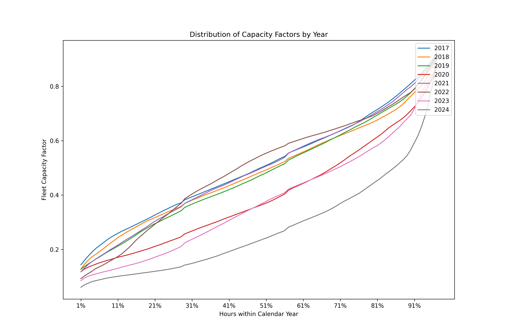

# 1. CCGT Distribution profile by year - based on actual generation

Since 2016, as more renewables have come onto the grid, the CCGT fleet has become increasingly flexible.

1. `download.py` - get the data from Elexon BMRS, and write separate files for each date in the directory `date/history/%Y-%m-%d.json`
2. `analyse.py` - open and plot graph showing the declining capacity factors of CCGTs since 2017. As a simplification, the maximum output in each year is used as the total capacity. 

At time of initial publishing, it should be noted that 2024 is not (as yet) complete.

# Data attribution
Data is sourced from [Elexon](https://bmrs.elexon.co.uk/). Warning, access to Elexon APIs is sometimes restricted for users outside the UK.

# Requirements
The packages required are loosely defined (without versions) in `requirements.txt`. 

# Outputs 

# 2. Without Balancing Market Activity

This is a second re-run of the analysis. Instead of taking actual aggregate generation, it instead takes the Physical Notification (or PN) values of gas plants and compares them with the MEL (maximum export limit) values that are provided to Elexon.

The code is located in `analyse_pn.py`.